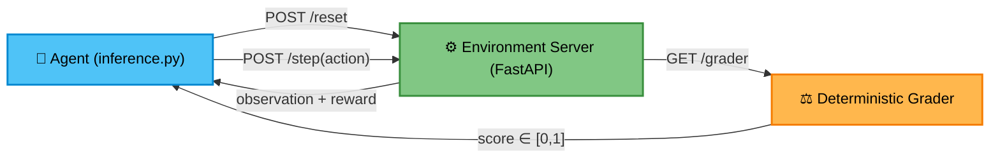

<div align="center">


# 🏛️ Contract Clause Analysis — OpenEnv
**A rigorous Deep RL environment where AI agents learn to review legal contracts like a law firm associate.**

[](https://huggingface.co/spaces/Atharva4/OpenEnvhackathon)
[](https://www.python.org/downloads/)
[](https://stable-baselines3.readthedocs.io/)
[](https://opensource.org/licenses/MIT)

*Built by **Kernel Crafters** for the Meta × PyTorch OpenEnv Hackathon.*

</div>

---

## 🚀 The Vision: Why we built this?

> **A single missed liability cap in a 50-page legal contract can cost millions.**

While modern Large Language Models can summarize text nicely, they lack the sequential, multi-step critical reasoning required to systematically comb through complex vendor agreements, flag embedded legal landmines, and synthesize risks.

This project transforms the traditionally manual process of legal contract review into a structured **Markov Decision Process**. It forces agents to practice reading clauses, analyzing legal intent, and executing procedural legal logic step-by-step.

---

## 🏆 Hackathon Highlights (Why this fits OpenEnv perfectly)

- 🎯 **100% Deterministic Evaluator**: A bulletproof grading formula perfectly bound between `[0.0, 1.0]` across 18 exhaustive PyTest suite checkpoints. No LLM-judge randomness.
- 🧠 **Native Deep RL Support**: Full, out-of-the-box compatibility with **PyTorch** & **Stable Baselines 3** via a custom `gymnasium` standard wrapper.
- ⚡ **Stateless & Asynchronous**: A pure HTTP/JSON FastAPI backend ensures robust parallel execution—meaning multiple agents can train simultaneously at insane speeds.
- 📊 **Built-in Ground Truth Data**: 13 fully embedded contract datasets spanning 3 difficulty tiers means zero network latency during rigorous evaluator testing.

---

## 🧠 Benchmark & Agent Performance

Does the environment actually provide a mathematically learnable signal? Yes.

| Agent Architecture | `clause_id` | `risk_flagging` | `contract_cmp` | Avg Score |
|--------------------|-------------|-----------------|----------------|-----------|
| **Random Baseline** (Proves difficulty) | 0.06 | 0.05 | 0.10 | **0.07** |
| **Tabular Q-Learning** (Demo) | 0.71 | — | — | *0.71* |
| **PyTorch PPO (Stable Baselines 3)** | **1.00** | — | — | *1.00* |
| **Rule-based Expert** (Proves solvability)| **1.00** | **1.00** | **0.81** | **0.94** |

<details>
<summary>💡 <b>Click to expand: Proof of Environment Signal</b></summary>
<br>
The monumental gap between the random baseline (0.07) and the rule-based expert (0.94) proves the environment provides a rich, highly learnable reward signal. This mathematically validates that the environment is not trivially solvable and heavily rewards agents that acquire and execute deep contextual reasoning over long episodic sequences.
</details>

---

## 🏗️ Architecture & Interaction Flow



---

## 📑 The Curriculum (3 Difficulty Tiers)

| ID | Tier | Steps | What the Agent Must Do |
|----|------|-------|------------------------|
| `clause_identification` | 🟢 **Easy** | 10 | Parse a 7-section employment contract. Sequentially identify and strictly classify every clause using legal categories. |
| `risk_flagging` | 🟡 **Medium** | 25 | Comb through hidden liability traps (e.g., perpetual data grabs). Flag risks, assess severity (low -> critical), and output legal justification. |
| `contract_comparison` | 🔴 **Hard** | 50 | Diff 2 full contract versions (Original vs Revised). Isolate sneaky semantic shifts, determine impact matrices, and draft formal counter-amendments. |

---

## 📡 Core API Specification

The environment exposes an ultra-lightweight REST signature conforming strictly to OpenEnv definitions.

| Endpoint | Method | Response Payload |
|----------|--------|------------------|
| `/health` | `GET` | Server pulse `{"status": "ok"}` |
| `/tasks` | `GET` | List all available environments and parameters |
| `/reset` | `POST` | Start episode `{"task_id": "...", "contract_index": 0}` |
| `/step` | `POST` | Execute `ContractAction`, returns `observation + reward` |
| `/state` | `GET` | Current episodic state footprint |
| `/grader` | `GET` | Final score query `{"score": 0.0}` |

<details>
<summary><b>🛠️ Expand to see PyTorch / SB3 Training Commands</b></summary>
<br>
We natively wrap our APIs through a standard <code>gymnasium</code> wrapper (<code>env_wrapper.py</code>), allowing a direct pipeline to Stable Baselines 3.

```bash
# Train the Tabular Q-Learning agent
python train_qlearning.py

# Train the Deep RL PyTorch PPO agent 
python train_ppo.py

# Run Inference with the PyTorch PPO Agent
python inference.py --mode ppo --task clause_identification --verbose
```
</details>

---

## ⚙️ Quick Start Installation

Run the exact environment exactly as the evaluator does:

```bash
# 1. Clone the environment
git clone https://github.com/apbhatt2007-ctrl/contract-clause-env.git
cd contract-clause-env

# 2. Install lightweight dependencies
pip install -r requirements.txt

# 3. Boot the environment server
uvicorn server.app:app --host 0.0.0.0 --port 7860
```

*Don't want to install it locally? Ping the active Hugging Face Space instantly:*
```bash
curl https://atharva4-openenvhackathon.hf.space/health
```

---
<div align="center">
<b>Built with ♥️ by Kernel Crafters under the MIT License</b>
</div>
