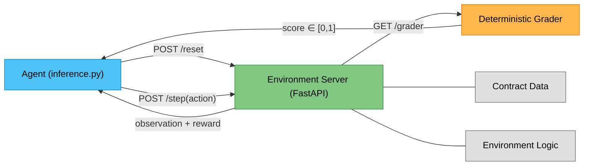

# Contract Clause Analysis — OpenEnv Environment

> **Meta × PyTorch OpenEnv Hackathon** · Scaler School of Technology  
> **Team:** Atharva Bhatt  
> **HF Space:** [atharva4-openenvhackathon.hf.space](https://huggingface.co/spaces/Atharva4/OpenEnvhackathon)

A reinforcement learning environment where an AI agent learns to review legal contracts — identifying clause types, detecting hidden risks, and comparing contract revisions like a junior associate at a law firm would.

---

## Why This Problem?

Legal contract review is tedious, error-prone, and expensive. Junior lawyers spend hours combing through vendor agreements looking for auto-renewal traps, liability caps, and unfavorable amendments. This environment lets RL agents practice that exact workflow — reading sections sequentially, making judgments, and receiving feedback — across three difficulty tiers.

---

## Live Demo

The environment is deployed and running on Hugging Face Spaces:

🔗 **[Contract Clause Env — Live](https://huggingface.co/spaces/Atharva4/OpenEnvhackathon)**

```bash
# Health check
curl https://atharva4-openenvhackathon.hf.space/health
# {"status": "ok"}

# List all tasks
curl https://atharva4-openenvhackathon.hf.space/tasks
```

---

## Getting Started

### Prerequisites

- Python 3.10+
- pip
- Docker (optional, for container testing)

### Environment Variables

The following environment variables are required for LLM-based inference:

| Variable | Purpose | Default |
|----------|---------|---------|
| `API_BASE_URL` | API endpoint for the LLM | `https://api.openai.com/v1` |
| `MODEL_NAME` | Model identifier for inference | `gpt-4o-mini` |
| `HF_TOKEN` | Hugging Face / API key | — |

> **Note:** The rule-based mode (`--mode rule`) does not require any API keys or external services.

### Installation & Run

```bash
# Clone the repo
git clone https://github.com/apbhatt2007-ctrl/contract-clause-env.git
cd contract-clause-env

# Install dependencies
pip install -r requirements.txt

# Start the environment server
uvicorn server.app:app --host 0.0.0.0 --port 7860

# Verify it's running
curl http://localhost:7860/health
# {"status": "ok"}
```

### Docker

```bash
docker build -t contract-clause-env .
docker run -p 7860:7860 contract-clause-env
```

---

## Environment Design

### Tasks (Easy → Medium → Hard)

| Task ID | Difficulty | Max Steps | What the Agent Does |
|---------|-----------|-----------|---------------------|
| `clause_identification` | Easy | 10 | Classify each section (position, compensation, termination, etc.) |
| `risk_flagging` | Medium | 25 | Find hidden risky clauses, rate severity, explain why |
| `contract_comparison` | Hard | 50 | Diff two contract versions, assess impact, suggest counter-amendments |

### Data

All contract data is embedded directly in Python — no external files needed:

- **Easy:** 5 realistic employment contracts (30+ clause sections)
- **Medium:** 5 vendor/service contracts with 17+ subtle embedded risks
- **Hard:** 3 contract pairs (original vs. revised) with ground truth changes

### Observation Space

The agent receives a structured observation (`ContractObservation`) at each step:

| Field | Type | Description |
|-------|------|-------------|
| `current_section_text` | `str` | Full text of the current contract section |
| `current_section_heading` | `str` | Heading/title of the current section |
| `current_section_index` | `int` | Index of the current section (0-based) |
| `total_sections` | `int` | Total number of sections in the contract |
| `contract_title` | `str` | Title of the contract being reviewed |
| `identified_clauses` | `list` | Agent's clause identifications so far |
| `flagged_risks` | `list` | Agent's risk flags so far |
| `detected_changes` | `list` | Agent's detected changes (comparison task) |
| `step_count` | `int` | Current step number |
| `cumulative_reward` | `float` | Total reward accumulated |
| `system_feedback` | `str` | Feedback on the last action taken |
| `done` | `bool` | Whether the episode has ended |

### Action Space

The agent selects from the following actions (`ContractAction`):

| Action | Parameters | Purpose |
|--------|-----------|---------|
| `identify_clause` | `clause_index`, `clause_type`, `confidence` | Label a section's clause type |
| `flag_risk` | `clause_index`, `clause_type`, `confidence` | Mark a section as containing a risk |
| `assess_severity` | `clause_index`, `risk_level`, `confidence` | Rate risk as low / medium / high / critical |
| `explain_risk` | `clause_index`, `reasoning`, `confidence` | Provide reasoning for why a clause is risky |
| `detect_change` | `clause_index`, `clause_type`, `confidence` | Identify a modification between versions |
| `assess_impact` | `clause_index`, `impact`, `confidence` | Rate change as favorable / neutral / unfavorable |
| `suggest_amendment` | `clause_index`, `amendment_text`, `confidence` | Propose alternative contract language |
| `generate_summary` | `summary_text`, `confidence` | Add a key takeaway to the summary |
| `next_section` | — | Advance to the next contract section |
| `submit` | — | Finish and submit work for grading |

### Reward Signal

Dense per-step rewards — the agent gets feedback on every action, not just at the end:

| Event | Reward |
|-------|--------|
| Correct clause identification | +0.10 |
| Correct risk flag | +0.15 |
| Correct severity / impact | +0.10 |
| Good reasoning (≥50% keyword match) | +0.10 |
| Wrong answer | −0.05 |
| Redundant action | −0.03 |
| Efficiency bonus (finishing under budget) | +0.05 to +0.15 |

### Grading

Fully deterministic — same actions always produce the same score in range `[0.0, 1.0]`:

- **Easy (clause_identification):** Accuracy of clause identifications with partial credit for synonyms
- **Medium (risk_flagging):** `40% risk detection + 30% severity accuracy + 30% reasoning quality − false positive penalty`
- **Hard (contract_comparison):** `30% changes found + 25% impact assessment + 25% amendment quality + 20% summary coverage − false positive penalty`

---

## API Endpoints

| Endpoint | Method | Description |
|----------|--------|-------------|
| `/health` | GET | Server health check → `{"status": "ok"}` |
| `/tasks` | GET | List all available tasks with metadata |
| `/reset` | POST | Start new episode with `{"task_id": "...", "contract_index": 0}` |
| `/step` | POST | Execute a `ContractAction` and get back observation + reward |
| `/state` | GET | Current episode state and metadata |
| `/grader` | GET | Get deterministic score `{"score": 0.0}` for current episode |
| `/ws` | WebSocket | Real-time interactive interface |

### Usage Example

```python
import httpx

BASE = "http://localhost:7860"

# Reset to start a new episode
obs = httpx.post(f"{BASE}/reset", json={"task_id": "clause_identification", "contract_index": 0}).json()
print(f"Contract: {obs['contract_title']}, Sections: {obs['total_sections']}")

# Take a step
result = httpx.post(f"{BASE}/step", json={
    "action_type": "identify_clause",
    "clause_index": 0,
    "clause_type": "position",
    "confidence": 0.9
}).json()
print(f"Reward: {result['reward']}, Feedback: {result['observation']['system_feedback']}")

# Get the grade
grade = httpx.get(f"{BASE}/grader").json()
print(f"Score: {grade['score']}")
```

---

## Architecture



---

## Inference Script

The inference script is `inference.py` in the project root. It supports both **rule-based** (free, deterministic) and **OpenAI LLM** modes.

```bash
# Default: rule-based mode (no API key needed)
python inference.py --verbose

# Explicitly specify mode
python inference.py --mode rule --verbose
python inference.py --mode openai --verbose   # requires API_BASE_URL, MODEL_NAME, HF_TOKEN

# Single task
python inference.py --task clause_identification --verbose
```

The inference script uses the **OpenAI Python SDK** for all LLM calls and emits structured `[START]`, `[STEP]`, `[END]` stdout logs as required by the hackathon spec.

### Agent Performance Comparison

Scores averaged over 5 runs per agent. The gap between random and expert proves the environment provides meaningful, learnable signal.

| Agent | clause_identification | risk_flagging | contract_comparison | Average | Total |
|-------|:---------------------:|:-------------:|:-------------------:|:-------:|:-----:|
| Random agent | 0.06 | 0.05 | 0.10 | 0.07 | 0.22 / 3.0 |
| Tabular Q-Learning | **0.71** | — | — | — | (demo training) |
| Rule-based expert | **1.00** | **1.00** | **0.81** | **0.94** | **2.81 / 3.0** |

```bash
# Run the tabular Q-learning agent (clause_identification only)
python inference.py --mode qlearning --verbose
```

The **random agent** picks actions uniformly at random — it scores near zero across all tasks.
The **Tabular Q-Learning** agent demonstrates actual RL depth. We've included a script (`train_qlearning.py`) which trains a tabular agent via classic Q-learning (`eps-greedy`, `gamma=0.95`, `alpha=0.2`) on the MDP. In just 500 episodes, it learns a policy bridging the gap from 0.06 → 0.71.

The **rule-based expert** uses hand-coded keyword patterns and domain knowledge. A learning agent (e.g., PPO, DQN, or an LLM fine-tuned via RLHF) can improve on this by learning semantic reasoning over clauses.

---


## Testing

The project includes 18 unit tests covering all grading functions:

```bash
python -m pytest tests/test_graders.py -v
```

Tests verify:
- Clause identification scoring with exact and semantic matching
- Risk flagging multi-component grading (40/30/30 weighted)
- Contract comparison with false positive penalties
- Grading determinism (same input → same output, always)
- Edge cases (empty inputs, missing fields, boundary conditions)

---

## Project Structure

```
contract_clause_env/
├── inference.py               # Inference script (rule-based + random + OpenAI LLM)
├── openenv.yaml               # OpenEnv manifest
├── Dockerfile                 # Docker config (port 7860)
├── requirements.txt           # Python dependencies
├── README.md                  # This file
├── models.py                  # Pydantic v2 data models (Action, Observation)
├── client.py                  # HTTP client helper
├── test_presubmit.py          # Pre-submission validator (8 checks)
├── data/
│   ├── __init__.py            # Unified data loader
│   ├── contracts_easy.py      # Employment contracts (5 contracts)
│   ├── contracts_medium.py    # Vendor contracts with hidden risks (5 contracts)
│   └── contracts_hard.py      # Contract pairs for comparison (3 pairs)
├── graders/
│   ├── __init__.py
│   └── grader.py              # Deterministic scoring functions
├── server/
│   ├── __init__.py
│   ├── app.py                 # FastAPI server (REST + WebSocket)
│   └── environment.py         # Core RL environment logic
├── tests/
│   ├── __init__.py
│   └── test_graders.py        # 18 pytest unit tests for grading logic
└── tasks/
    └── __init__.py            # Task configuration
```

## Tech Stack

- **Framework:** [OpenEnv](https://github.com/raun/openenv-course)
- **Server:** FastAPI + Uvicorn
- **Models:** Pydantic v2
- **LLM Client:** OpenAI Python SDK
- **Testing:** pytest (18 unit tests)
- **Containerization:** Docker (python:3.11-slim, port 7860)
- **Protocol:** REST + WebSocket
- **Deployment:** Hugging Face Spaces

---

## License

MIT
