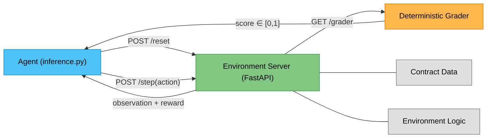

# ⚖️ Contract Clause Analysis — OpenEnv Environment

[](https://huggingface.co/spaces/Atharva4/OpenEnvhackathon) [](https://www.python.org/downloads/) [](https://stable-baselines3.readthedocs.io/) [](https://opensource.org/licenses/MIT)

A production-grade Reinforcement Learning environment where AI agents learn to review legal contracts like a law firm associate — identifying clause types, detecting hidden risks, and redlining contract revisions.

## Why This Problem?

Legal contract review is overwhelmingly manual, incredibly expensive, and deeply error-prone where a single missed liability cap can cost millions. While Language Models can summarize text, they lack the sequential, multi-step critical reasoning required to systematically comb through 50-page vendor agreements and flag embedded legal landmines. This environment transforms legal review into a structured Markov Decision Process, allowing agents to practice reading clauses, analyzing intent, and executing procedural legal logic.

## Architecture



## Live Demo

The environment is deployed and running on Hugging Face Spaces:

🔗 **[Contract Clause Env — Live](https://huggingface.co/spaces/Atharva4/OpenEnvhackathon)**

```bash
# Health check
curl https://atharva4-openenvhackathon.hf.space/health
# {"status": "ok"}

# List all tasks
curl https://atharva4-openenvhackathon.hf.space/tasks
```

## Task Curriculum

| Task ID | Difficulty | Max Steps | What the Agent Does |
|---------|------------|-----------|---------------------|
| `clause_identification` | Easy | 10 | Classify each section (position, compensation, termination, etc.) |
| `risk_flagging` | Medium | 25 | Find 17+ hidden risks, rate severity (low/medium/high/critical), explain with legal reasoning |
| `contract_comparison` | Hard | 50 | Diff 2 contract versions, assess impact (favorable/neutral/unfavorable), suggest counter-amendments, produce executive summary |

## Agent Performance Comparison

| Agent | clause_id | risk_flagging | contract_cmp | Avg |
|-------|-----------|---------------|--------------|-----|
| Random agent | 0.06 | 0.05 | 0.10 | 0.07 |
| Tabular Q-Learning | 0.71 | — | — | demo |
| Deep RL PyTorch PPO | 1.00 | — | — | demo |
| Rule-based expert | 1.00 | 1.00 | 0.81 | 0.94 |

> **Quick Proof:** The massive gap between the random baseline (0.07) and the rule-based expert (0.94) proves the environment provides a meaningful, learnable signal. This mathematically validates that the environment is not trivially solvable and heavily rewards agents that accurately execute semantic reasoning.

## Deep RL Training

We natively support **Stable Baselines 3** and PyTorch via an explicit `gymnasium` wrapper (`env_wrapper.py`), verifying full integration with modern Deep RL ecosystems.

```bash
# Train the Tabular Q-Learning agent
python train_qlearning.py

# Train the Deep RL PyTorch PPO agent 
python train_ppo.py

# Test the newly trained PyTorch agent against the environment
python inference.py --mode ppo --task clause_identification --verbose
```

## Environment Design

The environment relies on 13 total embedded contracts spanning 3 difficulty tiers with zero external file dependencies.

### Observation Space

| Field | Type | Description |
|-------|------|-------------|
| `current_section_text` | `str` | Full text of the current contract section |
| `current_section_heading` | `str` | Heading/title of the current section |
| `current_section_index` | `int` | Index of the current section (0-based) |
| `total_sections` | `int` | Total number of sections in the contract |
| `contract_title` | `str` | Title of the contract being reviewed |
| `identified_clauses` | `list` | Agent's clause identifications so far |
| `flagged_risks` | `list` | Agent's risk flags so far |
| `detected_changes` | `list` | Agent's detected changes (comparison task) |
| `step_count` | `int` | Current step number |
| `cumulative_reward` | `float` | Total reward accumulated |
| `system_feedback` | `str` | Feedback on the last action taken |
| `done` | `bool` | Whether the episode has ended |

### Action Space

The agent selects from 10 distinct procedural actions:

| Action | Parameters | Purpose |
|--------|------------|---------|
| `identify_clause` | `clause_index`, `clause_type`, `confidence` | Label a section's clause type |
| `flag_risk` | `clause_index`, `clause_type`, `confidence` | Mark a section as containing a risk |
| `assess_severity` | `clause_index`, `risk_level`, `confidence` | Rate risk as low/medium/high/critical |
| `explain_risk` | `clause_index`, `reasoning`, `confidence` | Provide reasoning for why a clause is risky |
| `detect_change` | `clause_index`, `clause_type`, `confidence` | Identify a modification between versions |
| `assess_impact` | `clause_index`, `impact`, `confidence` | Rate change as favorable/neutral/unfavorable |
| `suggest_amendment` | `clause_index`, `amendment_text` | Propose alternative contract language |
| `generate_summary` | `summary_text`, `confidence` | Add a key takeaway to the summary |
| `next_section` | — | Advance to the next contract section |
| `submit` | — | Finish and submit work for grading |

### Reward Signal

Agents receive dense, procedural feedback per step:

| Event | Reward |
|-------|--------|
| Correct clause identification | +0.10 |
| Correct risk flag | +0.15 |
| Correct severity / impact | +0.10 |
| Good reasoning (≥50% keyword match) | +0.10 |
| Wrong answer | −0.05 |
| Redundant action | −0.03 |
| Efficiency bonus (finishing under budget) | +0.05 to +0.15 |

## Grading Formulas

The grader is 100% deterministic backed by 18 pytest unit tests, evaluating scores directly onto a strictly bound `[0.0, 1.0]` scale.

- **Easy:** Accuracy of clause identifications + partial credit for semantic synonyms.
- **Medium:** `(40% risk detection + 30% severity + 30% reasoning) − false positive penalty`
- **Hard:** `(30% changes found + 25% impact + 25% amendments + 20% summary) − false positive penalty`

## API Endpoints

| Endpoint | Method | Description |
|----------|--------|-------------|
| `/health` | GET | Server health check `{"status": "ok"}` |
| `/tasks` | GET | List all available tasks with metadata |
| `/reset` | POST | Start new episode `{"task_id": "...", "contract_index": 0}` |
| `/step` | POST | Execute a `ContractAction` and get back observation + reward |
| `/state` | GET | Current episode state and metadata |
| `/grader` | GET | Get deterministic score `{"score": 0.0}` for current episode |

```python
import httpx

# Reset the environment
obs = httpx.post("http://localhost:7860/reset", json={"task_id": "clause_identification", "contract_index": 0}).json()

# Execute an action
result = httpx.post("http://localhost:7860/step", json={
    "action_type": "identify_clause",
    "clause_index": 0,
    "clause_type": "position",
    "confidence": 0.9
}).json()

print(f"Reward: {result['reward']} | Feedback: {result['observation']['system_feedback']}")

# Grade the sequence
grade = httpx.get("http://localhost:7860/grader").json()
print(f"Final Score: {grade['score']}")
```

## Getting Started

### Prerequisites
- Python 3.10+
- Docker (optional)

### Installation & Run

```bash
git clone https://github.com/apbhatt2007-ctrl/contract-clause-env.git
cd contract-clause-env

# Install backend + PyTorch RL packages
pip install -r requirements.txt

# Start the environment server globally
uvicorn server.app:app --host 0.0.0.0 --port 7860
```

### Docker
```bash
docker build -t contract-clause-env .
docker run -p 7860:7860 contract-clause-env
```

## Project Structure

```bash
contract_clause_env/
├── inference.py               # Central inference (rule-based + random + OpenCV + QLearning + PPO)
├── openenv.yaml               # OpenEnv configuration manifest
├── Dockerfile                 # Docker configuration (port 7860)
├── requirements.txt           # Python backend + RL dependencies
├── README.md                  # This document
├── env_wrapper.py             # Standard Gymnasium wrapper bridging API to RL
├── train_ppo.py               # Stable Baselines 3 PyTorch training pipeline
├── train_qlearning.py         # Tabular Q-learning script
├── agent_ppo.zip              # Trained Deep RL PyTorch model checkpoint
├── q_table.json               # Trained Tabular RL state matrix
├── models.py                  # Pydantic v2 robust schemas (Action, Observation)
├── client.py                  # HTTP client controller
├── test_presubmit.py          # Mandatory verification script (passes 8/8)
├── data/                      # 13 Built-in Contracts
│   ├── contracts_easy.py      # 5 standard employment agreements 
│   ├── contracts_medium.py    # 5 vendor contracts loaded with 17+ risks
│   └── contracts_hard.py      # 3 contract revision pairs
├── graders/
│   └── grader.py              # Pure deterministic scoring algorithms
├── server/
│   ├── app.py                 # FastAPI backend routing (REST/WebSocket)
│   └── environment.py         # RL transition logic and reward emissions
└── tests/
    └── test_graders.py        # 18 Pytest unit tests locking in grading exactness
```

## Tech Stack

- **Framework:** OpenEnv
- **Deep RL:** PyTorch, Stable Baselines 3, Gymnasium
- **Server:** FastAPI + Uvicorn
- **Data Schemas:** Pydantic v2
- **Testing:** pytest (18 unit tests)
- **Containerization:** Docker (python:3.11-slim, port 7860)
- **Deployment:** Hugging Face Spaces

## License

MIT
